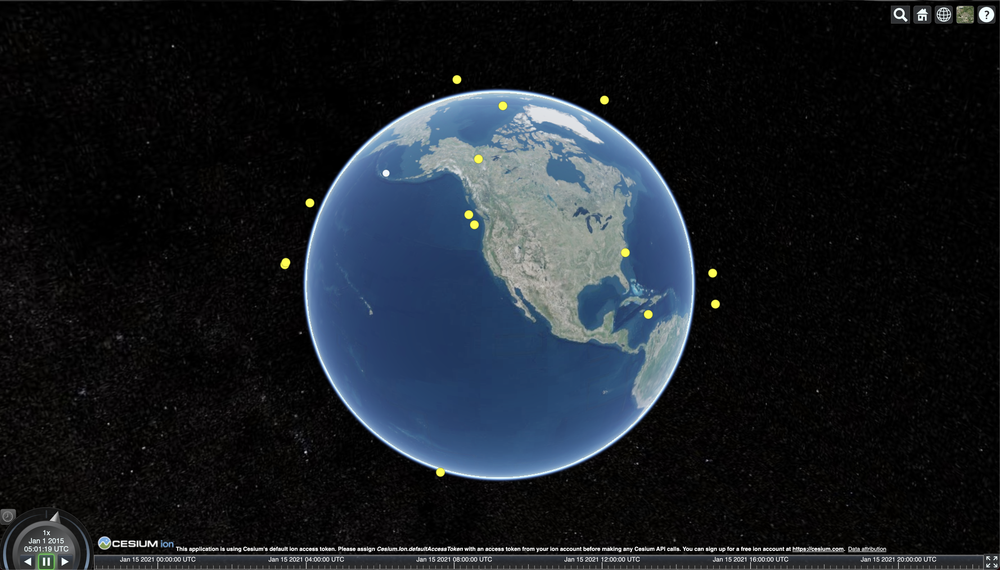
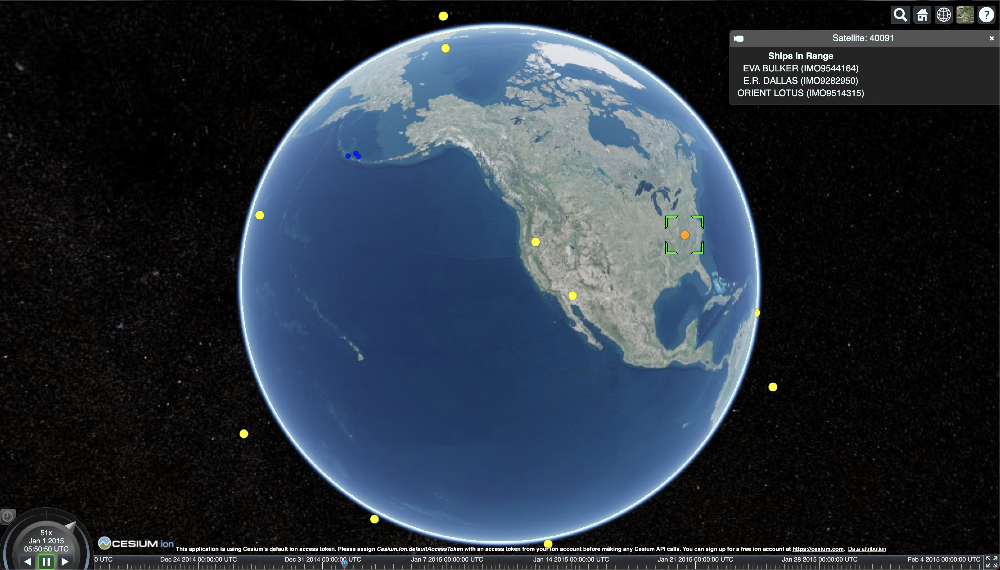
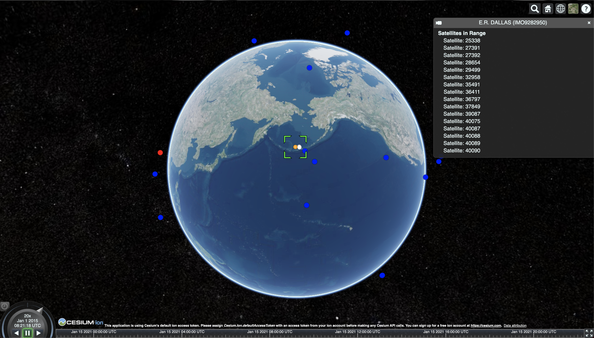

# VAULT Cesium Visualization

The purpose of this visualization is to get a better understanding of what satellites have coverage of ships at a given 
time over their voyage(s).

The image above depicts the view of the application upon running for the first time.
The yellow points around the earth represent the positions of satellites orbiting the earth at the specified time in
the cesium viewer, the simulation time is shown in the bottom left of the image.

The white point(s) on the earth represents the position of ship at the given simulation time.

The user has the ability to select satellites or ships in the application. 
Upon selecting a satellite a popup will appear giving more information about the satellite, and will display
a list of ships that the satellite has coverage of at the time.
Ships will also be colored Blue/Red based on if the selected satellite has coverage of the ship at that time (Shown in 
the image below).

Selecting a ship produces similar behavior and information, but from the perspective of the ship (Shown in the image 
below).

